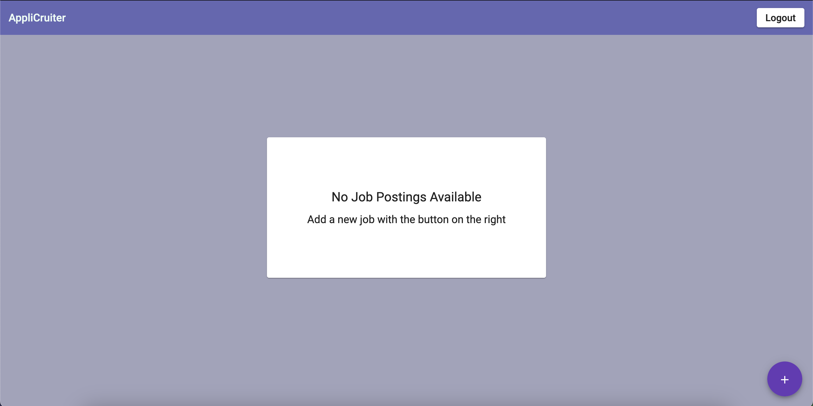
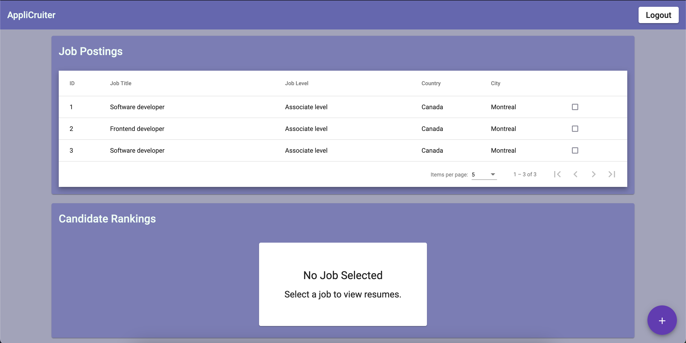
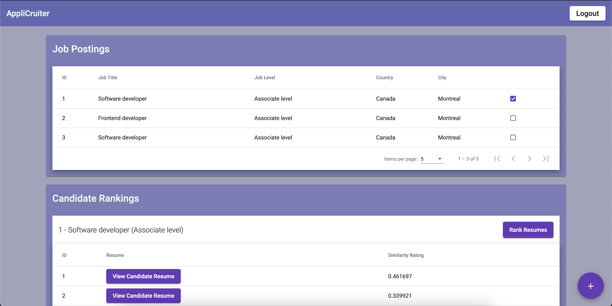
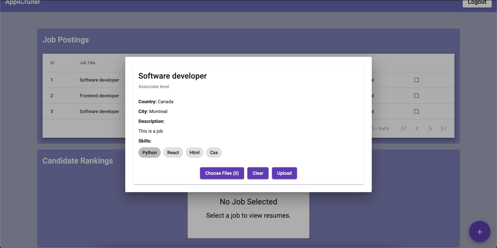

# AppliCruiter
## A Different Approach to Automated Tracking Systems for Businesses

<summary>Table of Contents</summary>
<ol>
    <li>
        <a href="#summary">Project Summary</a>
    </li>
    <li>
        <a href="#tech-stack">Tech Stack</a>
    </li>
    <li>
        <a href="#getting-started">Getting Started</a>
        <ul>
            <li><a href="#prerequisites">Prerequisites</a></li>
            <li><a href="#installation">Installation</a></li>
        </ul>
    </li>
    <li>
        <a href="#screenshots">Screenshots</a>
    </li>
    <li>
        <a href="#resources">Resources</a>
    </li>
    <li>
        <a href="#contact">Contact</a>
    </li>
</ol>

## Summary
- AppliCruiter is an application powered by machine learning that streamlines the resume screening process by efficiently categorizing and assessing resumes submitted for job openings.

## Tech Stack

### Server
- Written in Python, making use of the sentence_transformers library integrated with PyTorch. To enhance performance, we fine-tuned the all-mpnet-base-v2 model using an extensive dataset of resumes. Furthermore, we incorporated the pdfplumber library to effortlessly extract text from PDF resumes.
- A MySQL database was leveraged for storing persistent data related to jobs and resumes. This relational database ensures efficient and organized management of information crucial for seamless operations. 
- Amazon AWS S3 was leveraged to store resumes in the ubiquitous PDF format. Leveraging S3 buckets provides a scalable and secure solution for efficiently managing and accessing resume data, offering a reliable infrastructure for storage needs.
- Developed REST server using Flask to serve as the bridge that seamlessly connected our model and persistent data to the client. This permitted the creation of a responsive and efficient web application that can handle requests, process data, and deliver results.
- Built With
    - Python
    - PyTorch (sentence_transformers)
    - Flask
    - AWS S3
    - MYSQL
    - all-mpnet-base-v2 (fine-tuned with a comprehensive dataset of resumes)
    - pdfplumbler

### Client
- Written in TypeScript, making use of Angular to create a user-friendly interface for the application.
- The client seamlessly interacts with the server, providing real-time updates for each job posting created.The use of RX.js allowed observability, which made the application dynamically responsive to state changes. Whenever a new job posting, a new resume is created, the interface automatically updates in real-time, providing an efficient and intuitive user experience.
- Cypress was utilized for end-to-end testing to ensure the seamless functionality of the application from the user's perspective. 
- Built With
    - TypeScript
    - Angular
    - Material UI
    - Tailwind CSS
    - Cypress

## Getting Started

### Prerequisites
#### Versions Used During Development
- Client
    - Node - 18.17.0
- Server
    - Python - 3.8.18 ([MiniConda](https://docs.conda.io/projects/miniconda/en/latest/) - Python Environment Manager)
    - MYSQL - 8.1.0
    - S3 Bucket

### Installation
#### Steps

- Navigate to client directory within the project
- Verify that you have the correct version of Node installed
- Run the following: ```npm i```
- Manage the environment variables to properly utilize your hosted server
- Navigate to the server directory within the project
- Make sure your python virtual environment is currently activated
- Install required packages and dependencies with ```pip install -r requirements.txt```
- Externally make sure you have setup an S3 bucket to store data and that MYSQL is currently running
- Populate a new .env file by referencing the .env.example file
- Download the model from the dropbox in the resource section and unzip directly in server directory
- Run truncate_all.py to configure the MYSQL database and truncate the data within the given S3 bucket ```python truncate_all.py```
- Start the server with ```python main.py```
- Start the client with ```npm start```

### Screenshots







### Resources
- [Machine Learning Model](https://huggingface.co/spencerkifell/applicruiter-model)
- [Create S3 Bucket](https://docs.aws.amazon.com/AmazonS3/latest/userguide/creating-bucket.html)
- [MiniConda Setup](https://docs.conda.io/projects/miniconda/en/latest/miniconda-other-resources.html)

### Contact
Feel free to shoot me a message or connect with me on LinkedIn!
- [Email](mailto:spencerkifell.cs@gmail.com)
- [LinkedIn](https://www.linkedin.com/in/spencerkifell/)
